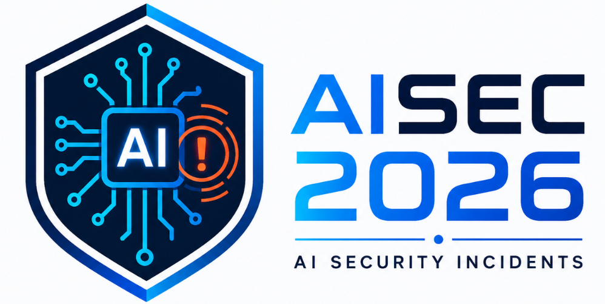

# ai_security_incidents_2026

A VERIS-coded catalogue of **2026 software-security incidents in which AI was materially involved** — as a cause, a weapon, a target, the loot, or the tool that found (or wrote) the flaw.

The dataset consolidates five original sources into one consistent, machine-readable corpus, each incident described with the [VERIS](https://verisframework.org/) schema plus a small AI-specific report layer, following the methodology in [`incidents/VERIS_Methodology_for_AI_Security_Incidents_concise.md`](incidents/VERIS_Methodology_for_AI_Security_Incidents_concise.md).

## Approach

**Incident-first.** The unit of this project is the *incident*, not the vulnerability. Everything else is derived from the incident list:

1. **Collect** 2026 software-security incidents in which AI was materially involved — from incident registers (AI Incident Database, VERIS Community Database) and research reports — each cited to its original source and to the primary reporting behind it.
2. **Code** every incident in VERIS plus a thin AI-specific report layer, with *observed* (realized) and *potential* severity kept separate.
3. **Validate and enrich** what the incidents cite: the CVEs are resolved against CVE.org / NVD / CISA KEV and classified by their relation to the incident; the CWEs are validated next. Vulnerability databases are used to check and enrich what the incidents cite — **not as the source of incidents**: a CVE record describes a vulnerability and carries no incident information.
4. **Derive** insights from the incident list — the CVE-side tables in `vulnerabilities/`, the forthcoming incident-based CWE priority list, and the analyses behind the AISEC 2026 talk — by scripts, so that every statistic traces back to the incidents that support it and is regenerated when the incident list changes.

## Why VERIS

Rather than invent a bespoke AI-incident score, this project adopts **VERIS** — the mature, open incident vocabulary behind the Verizon DBIR and the VERIS Community Database — as the single external framework, adding only a thin AI-specific layer on top. It fits better than the obvious alternatives: **CVSS** rates a *vulnerability's* technical severity, not what a realized incident actually did; **NCISS**'s coarse national-response categories discard the details that matter most here (records and credentials exposed, systems touched, confirmed-vs-possible disclosure); and **FAIR / FAIR-MAM** need quantitative loss data that public incident reports seldom provide. Coding to VERIS instead preserves those granular facts, natively separates confirmed breaches from near-misses and mere exposure, and lets these AI incidents be compared and pooled with the tens of thousands already in VCDB — the innovation is applying that established discipline to AI-related software-security incidents. Crucially, VERIS keeps the *incident* layer distinct from the *vulnerability/weakness* layer: exploited CVEs are referenced through VERIS's own `action.hacking.cve` / `action.malware.cve` fields, CVSS is never repurposed as incident severity, and CWE weaknesses are carried in the AI report layer with an explicit mapping basis (authoritative CVE/CNA vs analyst-inferred) rather than silently guessed.

## The dataset

**`incidents/all_2026_ai_software_security_incidents.{json,csv,md}`** — the same 99 incidents in three forms:

| File | What it is |
|---|---|
| `.json` | **Source of truth.** Full nested coding per incident, plus metadata, a source catalogue, and a ranking table. |
| `.csv` | One flattened row per incident (25 columns), including a `source_citations` column with full provenance. |
| `.md` | A severity-ranked field guide: an incident index plus a narrative entry per incident. |

The per-CVE validated layer (each CVE's relation to the incident, CVSS, KEV flag, CNA CWE, credits) exists in full only in the `.json`; the `.md` shows it condensed as a relation-grouped "Validated CVEs" line per entry, and the `.csv` lists only the CVE and CWE ids (`cve` as cited, `validated_cve`, `cwe`) — so a change to relations alters the `.json` and `.md` but not the `.csv`. The `.csv` and `.md` are currently maintained by hand alongside the JSON (no generator yet — see `CWE_validation_handover.md` §6), whereas everything under `vulnerabilities/` is regenerated by `scripts/build_vulnerabilities.py`.

**99 incidents**, severity-ranked by *observed* (realized) harm:

- **2 Critical · 22 High · 31 Medium · 21 Low · 23 Negligible**
- Status: 93 Confirmed · 1 Near miss · 5 False positive
- IDs: `DB-2026-nnn` (*database*: at least one register source — AIID or VCDB; 50 incidents) and `DR-2026-nnn` (*direct report*: no register source, found through a deep-research or primary report; 49 incidents, all of them so far from the three deep-research reports); `nnn` is the position in the priority ranking of 2026-08-27 and is never renumbered (new incidents continue from 100).

### How each incident is coded

Two layers are kept separate (per the methodology), so the standard security facts stay schema-compliant while the AI-specific judgements remain explicit:

- **`veris`** — canonical VERIS 1.4.1: Actor / Action / Asset / Attribute, CIA with graded `data_disclosure` (Yes / Potentially / No), scope, timeline, victim, confidence, and CVE linkage where applicable.
- **`report`** — AI-specific metadata: `ai_role`, `ai_component`, `ai_security_mechanism`, **Observed** vs **Potential** severity (each with a rationale and confidence), and CWE/CVE with a mapping basis.

**Observed and Potential severity are never collapsed into one score**, and neither is CVSS/AIRIS: severity here is a transparent ordinal rubric (Critical > High > Medium > Low > Negligible) derived from the VERIS evidence. Vulnerability-discovery and coordinated-disclosure PoC items therefore sit at low *observed* / high *potential*.

Non-software-security items carried by the registers (e.g. facial-recognition identification, doxxing, likeness disputes) are marked `security_incident: "False positive"`, and conventional breaches with no AI component are flagged in an `ai_involvement_note`; both are retained for register completeness.

### CVE-side tables (`vulnerabilities/`)

`python3 scripts/build_vulnerabilities.py` derives CSV tables and a report from the validated CVE layer of the JSON: which CVEs each incident involves and vice versa, the CVEs actually exploited / attempted / carried by AI-enabled attackers (with KEV and CVSS), the CVEs credited to AI discovery, the CNA-assigned CWE profile of the CVEs per segment (AI-exploited · AI-written · AI-stack vulnerabilities · malicious releases · AI-discovered · related), CVSS-vs-observed-harm, a first IBSS-vs-CVSS comparison (IBSS = incident-based severity score, the doubling-weight sum over linked incidents), an **action list** (patch / remove / watch, with affected and fixed versions taken from the CVE.org, GitHub Advisory and OSV records that `scripts/fetch_upstream.py` caches under `vulnerabilities/upstream/`), every KEV-listed CVE, non-CVE identifiers, and — as input for the forthcoming CWE validation — the CNA CWEs of each incident's in-play CVEs. The unit of those tables is the CVE link, not the incident; the incident-level CWE ranking is a separate, later step.

### Verifying and rebuilding

```
python3 scripts/fetch_upstream.py            # network: cache upstream records (CVE.org, GHSA, OSV, CISA KEV, VERIS schema)
python3 scripts/validate_incidents.py        # offline gate: exit 1 on any error
python3 scripts/build_vulnerabilities.py     # JSON + cache -> vulnerabilities/
python3 scripts/build_incidents_report.py    # JSON -> incidents/*.csv, incidents/*.md
python3 -m unittest discover tests           # verifier mutation tests; derived reports up to date
```

`validate_incidents.py` re-derives every copied CVE field (state, CNA, dates, product, title, CVSS, CWE, credits, KEV) from the cached records (Class A) and checks the bookkeeping of the JSON: validated-layer set algebra, the VERIS `action.*.cve` alignment, vocabularies, the ID scheme, the ranking table, recomputable counts, and every `veris` block against the VERIS JSON schema (Class B; needs the `jsonschema` package). It cannot check judgment: a CVE's `relation`, notes, severities, `ai_role`, or the inclusion decision. The rules are in the methodology, §10.2. The builders stop only on the core checks their tables rely on (ID format and numbering, validated-CVE sets, relation vocabulary, per-CVE agreement across incidents), not on the full gate.

## Repository layout

```
README.md
LICENSE                                            # licence split + MIT text (code)
LICENSE-CC-BY-SA-4.0.txt · LICENSE-CC-BY-4.0.txt   # data · methodology
incidents/
├─ all_2026_ai_software_security_incidents.json   # 99 incidents — source of truth
├─ all_2026_ai_software_security_incidents.csv    # flattened, one row per incident
├─ all_2026_ai_software_security_incidents.md     # severity-ranked field guide
├─ VERIS_Methodology_for_AI_Security_Incidents_concise.md
└─ sources/                                        # the original sources
   ├─ ChatGPT_DeepResearch_ai_incidents_2026.{md,docx,pdf}
   ├─ ClaudeCode_DeepResearch_ai_incidents_2026.{md,html}
   ├─ Grok_DeepResearch_ai_incidents_2026.md
   └─ incidentdatabase.ai_20260824_ai_incidents_2026.xlsx
scripts/
├─ fetch_upstream.py                              # CVE.org / GitHub Advisory / OSV records for the cited ids, CISA KEV, VERIS schema → vulnerabilities/upstream/ (network)
├─ lib_corpus.py                                  # shared loaders and vocabularies
├─ validate_incidents.py                          # the gate: Class A (upstream copies) + Class B (bookkeeping) checks (offline)
├─ build_vulnerabilities.py                       # incidents JSON + upstream cache → vulnerabilities/ (offline, stdlib, deterministic)
└─ build_incidents_report.py                      # incidents JSON → incidents/*.csv, *.md (offline, stdlib, deterministic)
tests/                                             # python3 -m unittest discover tests
vulnerabilities/                                   # derived CVE-side tables — see vulnerabilities/README.md
├─ README.md                                       # report: coverage, conventions, summary, all tables
├─ action_list.csv · kev_cves.csv                  # patch / remove / watch with affected + fixed versions · every KEV CVE in the corpus
├─ incident_cves.csv · cve_incidents.csv           # incident → CVEs (001–099) · CVE → incidents
├─ cves_exploited.csv · cves_ai_discovered.csv     # exploited-family evidence table · AI-discovered register
├─ cve_cwe_profile_by_segment.csv · cve_cwe_segment_totals.csv · ai_written_radar_profile.csv   # with IBSS per CWE / segment
├─ cwe_ibss_cve_path.csv                          # CNA-CWE IBSS via in-play CVEs — CVE-path baseline for the CWE ranking
├─ cvss_vs_observed.csv · incidents_cve_coverage.csv · ibss_vs_cvss.csv
├─ non_cve_identifiers.csv · incident_cna_cwes.csv # GHSA/MAL/PYSEC ids · CNA CWEs of in-play CVEs per incident
└─ upstream/                                       # raw upstream records, verbatim (manifest.json, LICENSES.md); never edited
```

Terminology: **sources** (`incidents/sources/`) are the incident sources — the registers and reports the incidents were collected from; **upstream** (`vulnerabilities/upstream/`) are the upstream records — vulnerability-database entries (CVE.org, GitHub Advisory Database, OSV) fetched by `scripts/fetch_upstream.py` for the identifiers those incidents cite, plus the CISA KEV catalog and the VERIS JSON schema. Both are kept verbatim and never edited.

## Sources & provenance

Every incident's `sources` field cites its **original** source(s):

- **`incidentdatabase.ai_20260824_ai_incidents_2026.xlsx`** — AI Incident Database (AIID) export, 2026-08-24 (cited with `AIID <id>` + the cite-page URL).
- **`vz-risk/VCDB`** — the [VERIS Community Database](https://github.com/vz-risk/VCDB), cited at the exact encoded record (`data/json/{validated,submitted}/<uuid>.json`) or the 2026 issue intake (`issues/<n>`). No local VCDB snapshot is bundled; citations point upstream.
- **`ChatGPT_DeepResearch_ai_incidents_2026.md`**, **`ClaudeCode_DeepResearch_ai_incidents_2026.md`**, **`Grok_DeepResearch_ai_incidents_2026.md`** — three independent deep-research incident reviews (kept in `incidents/sources/`).

Each record also carries **`veris.reference`** — the primary vendor/news/CVE reporting behind the incident (surfaced as the "Reporting" links in the `.md`).

Citation counts across the corpus: VCDB 41 · ClaudeCode 36 · ChatGPT 19 · AIID 17 · Grok 9.

## Scope

An event is included when **AI was materially involved** *and* there was an actual, suspected, or near-miss adverse effect on the confidentiality, integrity, availability, or authorization of a software/information asset. Non-security AI controversies (deepfake fraud, disinformation, likeness/IP disputes, autonomous-vehicle safety, harmful model output) are out of scope, except where a register carried them — in which case they are retained and clearly flagged as outside the criterion.

## Caveats

- Several incidents rest on vendor self-disclosure or researcher/attacker claims; per-incident `confidence` reflects this, and "first-of-kind" claims are researcher/vendor assessments. Verify any single figure against the linked primary source.
- Severity ranking is a documented judgement, not a formal aggregate; items near tier boundaries could reasonably be reordered.
- The `.csv` and `.md` are **derived** from the `.json`; treat the JSON as authoritative.

## License

| what | licence |
|---|---|
| Data: `incidents/all_2026_ai_software_security_incidents.{json,csv,md}`, `vulnerabilities/*.csv`, `vulnerabilities/README.md` | [CC BY-SA 4.0](https://creativecommons.org/licenses/by-sa/4.0/) (`LICENSE-CC-BY-SA-4.0.txt`) |
| Methodology: `incidents/VERIS_Methodology_for_AI_Security_Incidents_concise.md` | [CC BY 4.0](https://creativecommons.org/licenses/by/4.0/) (`LICENSE-CC-BY-4.0.txt`) |
| Code: `scripts/`, `tests/` | MIT (`LICENSE`) |
| Deep-research reports in `incidents/sources/` | CC BY-SA 4.0, as far as the author holds rights in them; material they quote keeps its owners' rights |
| AIID export in `incidents/sources/` | CC BY-SA 4.0, see attribution below |
| Upstream records in `vulnerabilities/upstream/` | each source's own licence, see `vulnerabilities/upstream/LICENSES.md` |

Copyright © 2026 Dave Farago.

**Why the data is share-alike.** The dataset adapts material from two registers that are licensed CC BY-SA 4.0: for some incidents, the summary paraphrases the register's summary, and one VERIS coding follows its VCDB record. CC BY-SA 4.0 requires adapted material to carry the same licence. The VERIS vocabulary itself does not impose a licence on the data: the incidents use its field names and values, and copy no VERIS text.

**Attribution of adapted material.**

- **VERIS Community Database (VCDB)**, the vz-risk VCDB project and its contributors, https://github.com/vz-risk/VCDB, licensed [CC BY-SA 4.0](https://github.com/vz-risk/VCDB/blob/master/LICENSE.txt). Used: encoded incident records and 2026 issue intake, cited per incident in `sources[]`. Changes: summaries paraphrased and combined with other sources; VERIS codings adopted or revised, and extended with a report layer.
- **AI Incident Database (AIID)**, Responsible AI Collaborative, https://incidentdatabase.ai/, database collections licensed [CC BY-SA 4.0](https://incidentdatabase.ai/terms-of-use/) (report texts are excluded from that licence and are not included here). Used: `incidents/sources/incidentdatabase.ai_20260824_ai_incidents_2026.xlsx`, an export of 73 incidents of 2026 (of 1,641) with their MIT, GMF and CSETv1 classifications and derived coverage columns; cited per incident in `sources[]`. Changes: selected 2026 incidents re-coded in VERIS.

Nothing here implies endorsement by Verizon, the Responsible AI Collaborative, MITRE, CISA or any other source.
